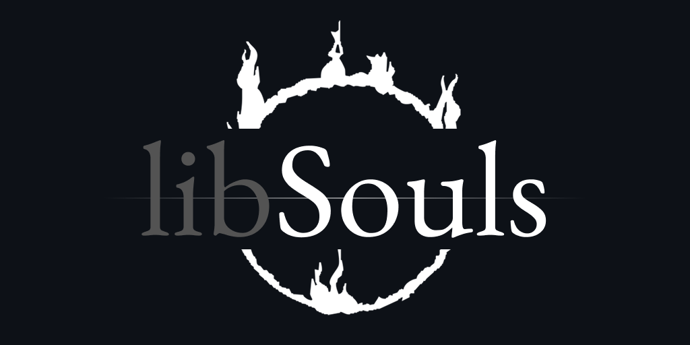

<p align="center">
  
</p>

<p align="center">
<a href="#examples">Examples</a> | <a href="#building">Building</a> | <a href="#license">License</a> 
</p>

**libSouls** is a C++ library for working with and modifying FromSoftware's Souls games (Dark Souls, ELDEN RING, Sekiro,
etc.). It is partially a port of the renowned [SoulsFormats](https://github.com/JKAnderson/SoulsFormats) C# library with
additions for other functionality beyond
modifying game file formats. It aims to be easily integrable, extensible, and to open the door for language bindings
such that mods can theoretically be written in any language one desires without redoing the ground work already laid by
the wonderful Souls modding community.

## Why C++?

SoulsFormats is the foundation of the Souls modding scene, and its quality is the reason so many tools exist. But
because
it is a .NET library, the tools built on it (Smithbox, DSMapStudio, DarkScript3, etc.) are tied to the .NET ecosystem,
and anyone working in another language has to rewrite years of format knowledge from scratch. libSouls is a native
implementation of the same formats, meant to **complement** the existing tools rather than replace them.

A native library with a stable C interface (planned) offers things a managed library can't easily match:

- **Any language can use it.** Python, Rust, Lua, C#, and others can call it directly, without hosting a .NET runtime in
  the process.
- **It works inside the game.** Many mods are native DLLs injected into the game process. These can use libSouls to read
  and write the formats in-process, which isn't practical with a managed library.
- **It's easy to ship.** There is no runtime to install, and it is a small dependency for native tools, including ones
  that use C++ libraries like ImGui, DirectX, or Vulkan directly instead of through bindings.

*Why not compile SoulsFormats with .NET NativeAOT and export a C interface instead?* That is a reasonable route, but it
keeps a managed codebase (with its own runtime, garbage collector, and debugging story) behind a native facade. A native
codebase is simpler to reason about, profile, and debug for the in-process and cross-language cases above. Performance
is a side benefit rather than the goal, and any claims about it will be backed by benchmarks as they become available.

#### The format knowledge in SoulsFormats took years of community work to build. libSouls aims to make that work available in more places.

## Roadmap

This is the planned development roadmap for libSouls:

### ✔️ Porting SoulsFormats

libSouls isn't aiming for 100% coverage of SoulsFormats out of the box, but instead to port the most relevant and
commonly used
portions first before eventually circling back and filling in the gaps (console-only and legacy formats, ELDEN RING and
Sekiro variants). This stage is largely complete and most actions
mod developers desire are possible with libSouls right now.

### 🚧 C API

This is the stage that brings a stable C API for creating other language bindings. Work on this has begun, but libSouls
today is a C++-only library.

### 🚧 Gap-filling SoulsFormats

Fill in missing functionality and formats from SoulsFormats for complete coverage of the original library.

### 🚧 Additional Features

Once the C API is in place, work on additional features can begin. Nothing concrete is planned for this stage yet and
what gets implemented will largely be determined by community demand and my own personal vision for the project.

### 🚧 Maintainence and Stability Improvements

The final stage is continuing to improve API stability, fix bugs, and support more features. libSouls version 1.0 will
be the point at which this stage is entered, and where it will remain for the rest of its development lifecycle.

### Missing / Not Planned

Everything listed here is open for contributions but is not something I plan on adding to libSouls myself.

- GCC or Clang support
- Static linking

## Documentation

- [Quickstart](Docs/Quickstart.md): link the library, learn the API shape, and write a first program.
- [Examples](Docs/Examples.md): recipes for archives, text, params, textures, maps, models and compression.

## Building

Before building libSouls, ensure your local development environment meets the following requirements:

- MSVC with Windows 11 SDK (*Linux not supported*)
- CMake (*>= v3.26*)
- Internet connection (*required to fetch zlib dependency on first configure*)
- Ninja Build (*not required but HIGHLY recommended*)

> [!IMPORTANT]
> Execute the following commands from within a **VS Developer PowerShell**. Failure to do so will result in
CMake failing to locate the correct compiler and the configuration/build will fail. Support for GCC or Clang is not
tested nor supported.

### 1. Clone the repository

```shell
git clone https://github.com/jakerieger/libSouls
```

### 2. Configure CMake

```shell
cd libSouls

cmake -B build/Debug -G Ninja -DCMAKE_BUILD_TYPE=Debug
# OR
cmake -B build/Release -G Ninja -DCMAKE_BUILD_TYPE=Release
```

### 3. Build libSouls

```shell
cmake --build build/<CONFIG>
```

### 4. Run tests

Some tests use real game files in order to validate file format implementations. If you want to run the full testsuite,
you'll need a valid Steam install of both Dark Souls Remastered and ELDEN RING with ELDEN RING's content unpacked via
UXM or Nuxe. A select number of random game files are pulled and tested against.

```shell
ctest --test-dir build/<CONFIG> --output-on-failure
```

The final `Souls.dll` library can be found in `build/<CONFIG>/bin`. libSouls currently does not support static linking.

> [!NOTE]
> `oo2core_6_win64.dll` needs to exist in the same path as `Souls.dll` and whatever executable is utilizing this
library. It can be copied from whichever From game you are modding (DS1/2/3, ELDEN RING, Sekiro, etc.).
>
> It contains the proprietary [Oodle](https://www.radgametools.com/oodle.htm) codec used by the game engine and without
> it, none of the game file formats can be read, modified, or written to.
>
> **Optionally**, your project can tell libSouls where to find the DLL instead, by calling `Oodle26::SetDLLPath` once
> before any Oodle-compressed file is read or written (the first use loads the DLL):
> ```cpp
> #include <libSouls/Oodle26.hpp>
>
> Souls::Oodle26::SetDLLPath("Path/To/oo2core_6_win64.dll");
> ```
> It returns `false` (and changes nothing) if the DLL has already been loaded. If an earlier attempt failed because the
> path was wrong, you can call it again with the corrected path. `Oodle26::IsAvailable()` reports whether the DLL could
> be loaded.

## Contributing

Contributions are more than welcome. I'm one guy with limited free time and any help is greatly appreciated.

> [!IMPORTANT]
> If you'd like to contribute, **please submit an issue prior to submitting a pull request so we can discuss an
implementation plan.**

## License

libSouls is licensed under the [ISC license](LICENSE).